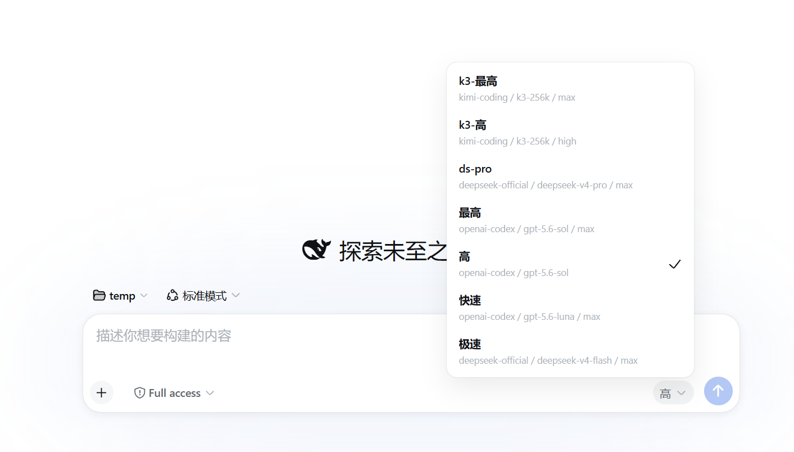
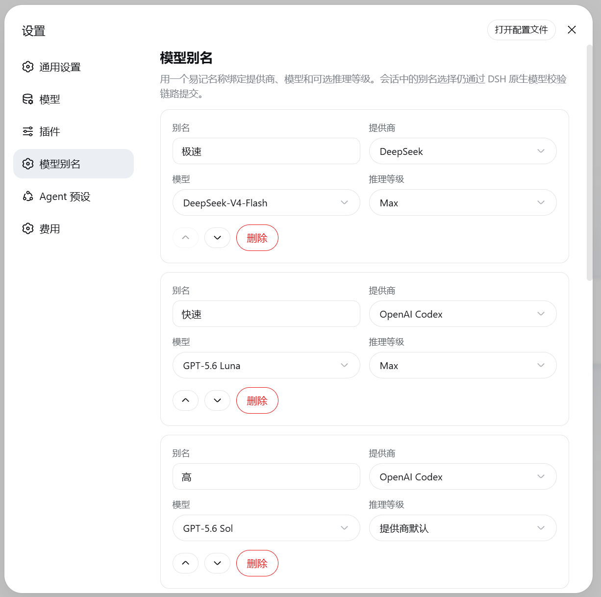

<h1 align="center">dsh-model-aliases</h1>

<p align="center">给模型配置起个好记的名字，然后在 DeepSeek Harness 会话里一键切换。</p>

在输入框旁用别名一键切换，原生“模型 / 推理等级”选择器同时保留：



在 **设置 → 模型别名** 中集中编辑：



## 安装

```sh
dsh plugin --profile web add github:ZhangZiFei/dsh-model-aliases
```

重启当前 `dsh web` 进程并刷新页面，然后打开 **设置 → 模型别名**。

**当前兼容目标为 DeepSeek Harness Web 0.1.2-rc.1。** 插件已经声明 DSH Bundle，安装命令会自动把对应 Patch 加入 Web Profile，无需手工编辑 `cordis.patch.yml`。

## 你会得到

- **一个别名代表完整模型配置**——名称同时绑定提供商、模型和可选推理等级
- **与原生选择器并存**——别名选择器排在输入框右下角、原生“模型 / 推理等级”控件右侧，原生控件保持可见
- **双向同步**——选择别名会改写原生控件的内容；在原生控件里手动选择模型或推理等级，别名选择器也会同步显示对应别名或“自定义”
- **原生模型选择链路**——所有选择仍交给 DSH `ModelDirectory.select()` 校验和应用
- **持久化设置**——配置写入 DSH 的 `model-aliases` 设置命名空间，重启后继续生效
- **目录感知**——直接选择当前会话可用的提供商、模型和模型声明的推理等级
- **安全保留失效配置**——目录中暂时不存在的别名不会丢失，但会禁用并说明原因
- **准确显示当前状态**——完整选择匹配别名时显示别名，否则显示“自定义”
- **遵守会话限制**——锁定状态下禁止切换，被寻址的子代理会话不显示选择器

## 使用

1. 打开 **设置 → 模型别名**。
2. 添加别名，选择提供商、模型以及可选推理等级。
3. 调整顺序并保存。
4. 回到会话，在输入框右下角的原生模型选择器右侧用别名选择器切换；原生选择器会同步显示当前模型和推理等级，也可以直接在那里手动选择。

推理等级选择“提供商默认”时，插件不会写入虚构的默认值，而是保留适配器或提供商的原始行为。

首次使用会写入预置别名；如果保存空列表，插件也会自动恢复预置值。预置路由不在当前模型目录时会保留，但不能被选择。

## 设置格式

配置保存在 DSH 设置文档的 `model-aliases` 分节：

```yaml
model-aliases:
  aliases:
    - name: 日常
      provider: deepseek
      model: deepseek-chat
    - name: 深度推理
      provider: openai
      model: o3
      reasoningEffort: high
```

规则：

- 名称、提供商、模型以及存在的推理等级必须是首尾无空白的非空字符串
- 别名名称必须唯一
- 提供商、模型和推理等级组成的完整选择必须唯一
- 省略 `reasoningEffort` 表示使用适配器或提供商默认行为

## 卸载

```sh
dsh plugin --profile web remove dsh-model-aliases
```

完成后重启当前 `dsh web` 进程并刷新页面。

## 开发

```sh
pnpm install
pnpm run build
pnpm test
pnpm pack --dry-run
```

构建产物位于 `lib/`：

- `lib/index.js`：Host 插件入口
- `lib/client.js`：Web Client Bundle
- `lib/types/`：TypeScript 声明

## 反馈

发现问题或有功能建议，请提交到 [GitHub Issues](https://github.com/ZhangZiFei/dsh-model-aliases/issues)。

## 许可

MIT
