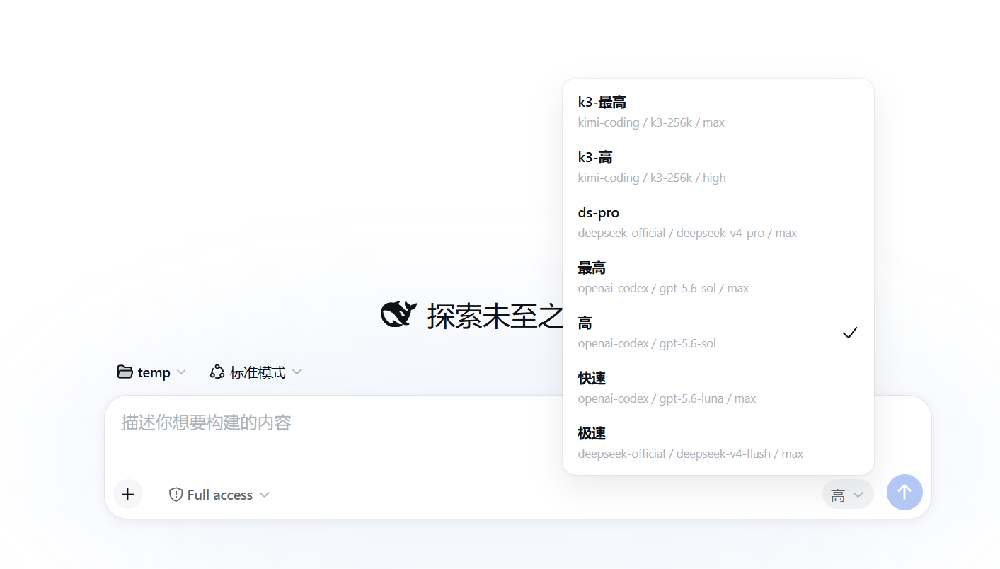
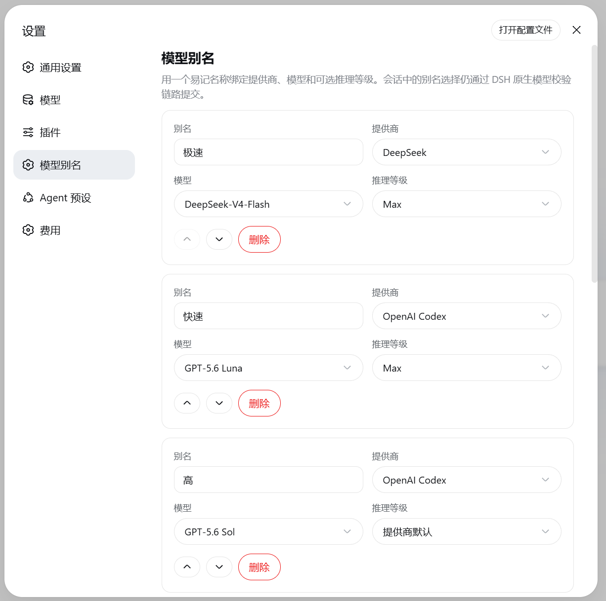

<h1 align="center">dsh-model-aliases</h1>

<p align="center">给模型配置起个好记的名字，然后在 DeepSeek Harness 会话里一键切换。</p>

在输入框旁用别名一键切换，原生“模型 / 推理等级”选择器同时保留：



在 **设置 → 模型别名** 中集中编辑：



## 安装

```sh
dsh plugin --profile desktop add github:ZhangZiFei/dsh-model-aliases
```

重启当前 DSH 进程并刷新页面，然后打开 **设置 → 模型别名**。

**当前兼容目标为 DeepSeek Harness 0.2.0-rc.2。** 插件已经声明 DSH Bundle，安装命令会自动把对应 Patch 加入 Profile，无需手工编辑 `cordis.patch.yml`。

## 你会得到

- **一个别名代表完整模型配置**——名称同时绑定提供商、模型和可选推理等级
- **与原生选择器并存**——别名选择器位于输入框工具行，原生“模型 / 推理等级”控件保持可见
- **双向同步**——选择别名会改写原生控件的内容；在原生控件里手动选择模型或推理等级，别名选择器也会同步显示对应别名或“自定义”
- **原生模型选择链路**——所有选择仍交给 DSH `ModelDirectory.select()` 校验和应用
- **持久化配置**——别名保存在 profile patch 的 `model-aliases` 条目里，重启后继续生效
- **目录感知且支持自定义**——可从当前会话目录下拉选择提供商、模型和推理等级，也可在同一字段直接输入自定义 ID
- **安全保留失效配置**——目录中暂时不存在的别名不会丢失，但会禁用并说明原因
- **准确显示当前状态**——完整选择匹配别名时显示别名，否则显示“自定义”
- **遵守会话限制**——锁定状态下禁止切换，被寻址的子代理会话不显示选择器

## 使用

1. 打开 **设置 → 模型别名**。
2. 添加别名，从下拉菜单选择或直接输入提供商、模型以及可选推理等级。
3. 调整顺序并保存。
4. 回到会话，在输入框右下角用别名选择器切换；旁边的原生模型选择器会同步显示当前模型和推理等级，也可以直接在那里手动选择。

推理等级选择“提供商默认”时，插件不会写入虚构的默认值，而是保留适配器或提供商的原始行为。

保存空列表时，界面按预置别名显示；预置或自定义的路由不在当前模型目录时会保留，但不能被选择。

## 设置格式

别名是 profile patch 中 `model-aliases` 条目的配置（也可在 **设置 → 插件** 里查看）：

```yaml
- id: model-aliases
  name: dsh-model-aliases
  config:
    aliases:
      - name: 日常
        provider: deepseek
        model: deepseek-chat
      - name: 深度推理
        provider: openai
        model: o3
        reasoningEffort: high
```

从 0.1 升级时，旧 `settings.yaml` 里的 `model-aliases.aliases` 段会在插件首次启动时自动迁移到该条目一次。

规则：

- 名称、提供商、模型以及存在的推理等级必须是首尾无空白的非空字符串
- 别名名称必须唯一
- 提供商、模型和推理等级组成的完整选择必须唯一
- 省略 `reasoningEffort` 表示使用适配器或提供商默认行为

## 卸载

```sh
dsh plugin --profile desktop remove dsh-model-aliases
```

完成后重启当前 DSH 进程并刷新页面。

## 开发

```sh
pnpm install
pnpm run build
pnpm test
pnpm pack --dry-run
```

构建产物位于 `lib/`：

- `lib/index.js`：Host 插件入口（`Config` schema + 页面策略 + 旧设置迁移）
- `lib/client.js`：Web Client Bundle（选择器与设置页）
- `lib/types/`：TypeScript 声明

## 反馈

发现问题或有功能建议，请提交到 [GitHub Issues](https://github.com/ZhangZiFei/dsh-model-aliases/issues)。

## 许可

MIT
